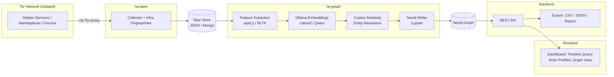

# Architecture

## 1. App Flow



## 2. Repo / Folder Structure

```
sih-26151-darkweb-deanon/
├── docker-compose.yml
├── .env.example
├── docs/                      <- all the .md files from this set
├── frontend/
├── backend/
├── scraper/
└── ai-graph/
    ├── Dockerfile
    ├── requirements.txt
    ├── .env.example
    ├── data/
    │   ├── sample_texts.json
    │   ├── rejected/
    │   └── pending_writes.jsonl
    ├── src/
    │   ├── features/          # sentence length, punctuation, n-grams
    │   ├── embeddings/        # Ollama client wrapper
    │   ├── resolution/        # cosine similarity, clustering
    │   ├── graph/              # Neo4j driver + Cypher writer
    │   └── pipeline.py         # orchestrates the above
    ├── tests/
    └── Memory.md
```

## 3. Tech Stack Summary

| Layer | Choice |
|---|---|
| Graph DB | Neo4j (community, containerized) |
| Local LLM | Ollama running Llama 3 or Qwen |
| NLP | spaCy / NLTK |
| Similarity | scikit-learn / numpy cosine similarity |
| Orchestration (ai-graph) | Python 3.11 |
| Containerization | Docker + Docker Compose |
| CI | GitHub Actions, path-filtered per folder |

## 4. Docker Compose (services relevant to ai-graph)

```yaml
services:
  neo4j:
    image: neo4j:5-community
    environment:
      NEO4J_AUTH: ${NEO4J_USER}/${NEO4J_PASSWORD}
    ports: [ "7474:7474", "7687:7687" ]
    volumes: [ neo4j_data:/data ]

  ollama:
    image: ollama/ollama
    volumes: [ ollama_data:/root/.ollama ]
    ports: [ "11434:11434" ]
    # GPU acceleration optional — see Docker.md

  ai-graph:
    build: ./ai-graph
    depends_on: [ neo4j, ollama ]
    env_file: ./ai-graph/.env
    volumes: [ ./ai-graph:/app ]

volumes:
  neo4j_data:
  ollama_data:
```

Full details, model-pulling, and GPU notes: see `Docker.md`.

## 5. Why This Shape

- The raw store decouples `scraper` and `ai-graph` in time — `ai-graph` never
  needs the scraper running, satisfying the independence strategy.
- Neo4j is the single shared source of truth between `ai-graph` and
  `backend` — no duplicated identity logic on the backend side.
- Every AI/graph component runs local-only (Ollama + Neo4j in Docker), so the
  demo has zero external dependencies or API costs.
